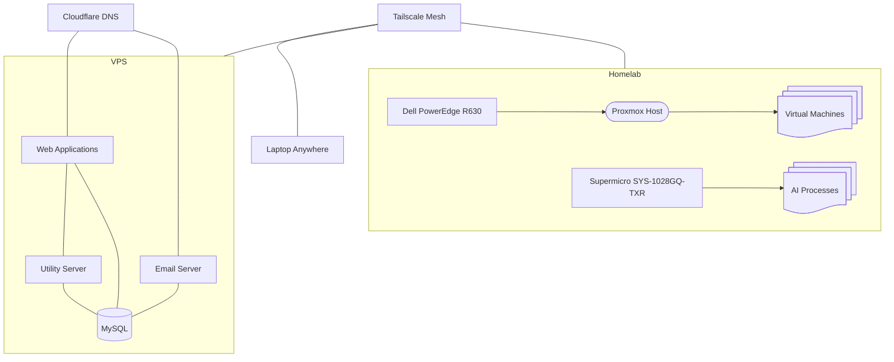

# Homelab Infrastructure

Personal infrastructure used to learn, build, and operate self-hosted services, virtualization, remote access, and AI workloads. Current efforts focus on migrating services from a VPS into the homelab while building toward highly available, containerized AI inference infrastructure.

As it stands currently:

## Architecture

## Environment

| Area             | Technology                          |
| ---------------- | ----------------------------------- |
| Servers | Proxmox VE, Ubuntu 22+ |
| Web Stack        | Apache, PHP, MySQL             |
| Utility Services | Python 3.10, systemd                |
| Email            | Postfix, Dovecot             |

## Objectives

* Learn VM deployment and management through Proxmox
* Develop an understanding of containerized workloads
* Develop AI inference infrastructure & self-hosted services
* Improve monitoring and automation
* Document lessons learned

## Repository Contents

| Folder    | Purpose                                      |
| --------- | -------------------------------------------- |
| journal/  | Build log, troubleshooting notes, milestones |

(Additions as needed.)

## Recent Milestones

* Integrated servers into home LAN.
* Tailscale setup and verified
* Expandec utility server functionality
* Reorganizing GitHub around infrastructure and project documentation
