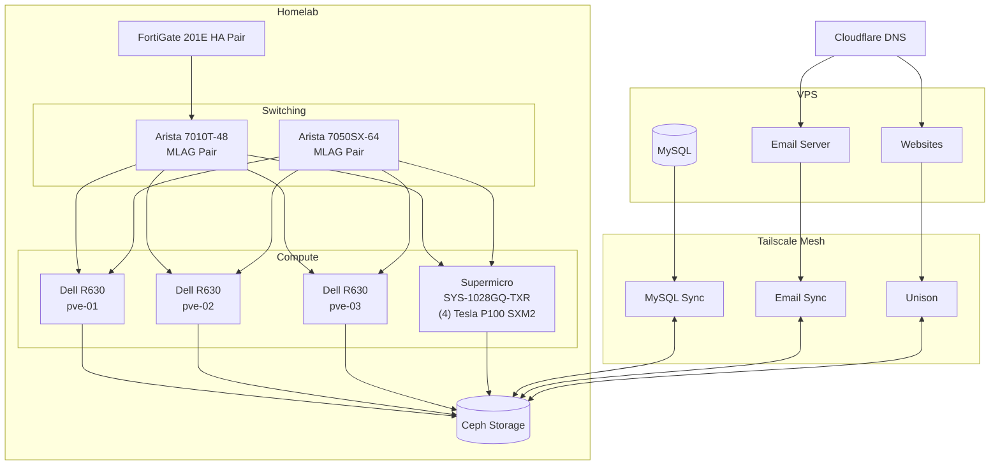
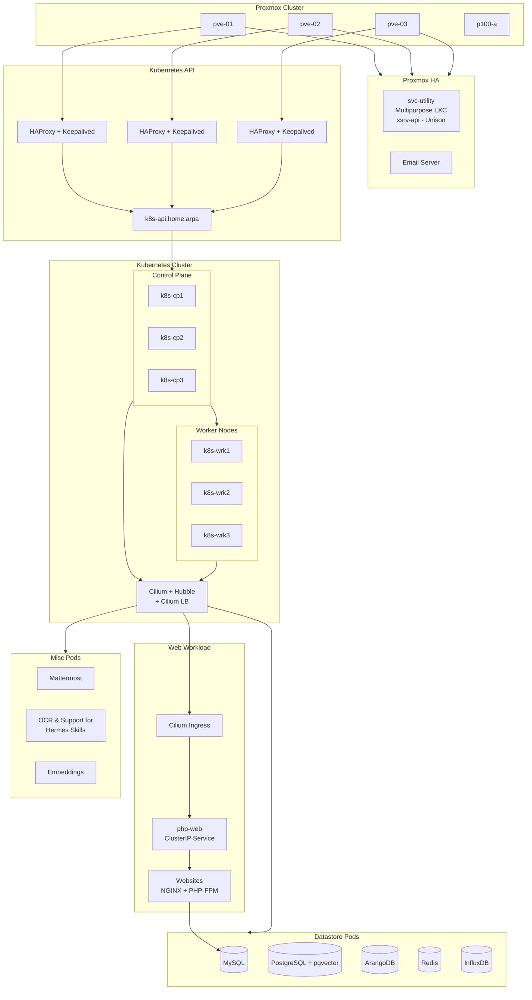
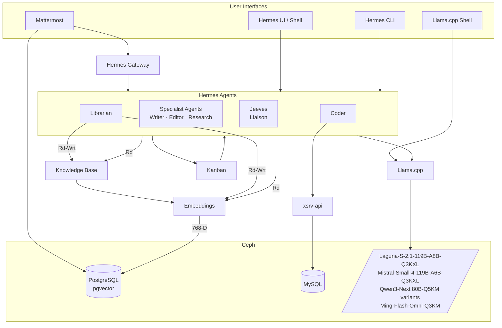

# Homelab Infrastructure

Personal infrastructure used to learn, build, and operate self-hosted services, virtualization, networking, storage, web services, and AI workloads. The environment has grown from a small collection of servers into a distributed homelab spanning Proxmox, Ceph, Kubernetes, dedicated AI hardware, and a VPS.

This repository documents the current architecture and, through the [journal](journal/README.md), how it got there.

## Architecture

### Physical Infrastructure & Connectivity

The homelab consists primarily of three Dell PowerEdge R630 servers providing clustered compute and Ceph storage, with a Supermicro GPU server dedicated to AI workloads. A remote VPS remains part of the environment for public-facing services and is connected to the homelab through Tailscale and several synchronization paths.

```mermaid
flowchart TB

    CF["Cloudflare DNS"]

    subgraph VPS["VPS"]
        Websites["Websites"]
        Email["Email Server"]
        VPSDB[("MySQL")]
    end

    subgraph Homelab["Homelab"]
        FW["FortiGate 201E HA Pair"]

        subgraph Switching["Switching"]
            AR7010["Arista 7010T-48<br/>MLAG Pair"]
            AR7050["Arista 7050SX-64<br/>MLAG Pair"]
        end

        subgraph Compute["Compute"]
            PVE1["Dell R630<br/>pve-01"]
            PVE2["Dell R630<br/>pve-02"]
            PVE3["Dell R630<br/>pve-03"]
            GPU["Supermicro<br/>SYS-1028GQ-TXR<br/>(4) Tesla P100 SXM2"]
        end

        Ceph[("Ceph Storage")]
    end

    subgraph TS["Tailscale Mesh"]
        MySQLSync["MySQL Sync"]
        EmailSync["Email Sync"]
        Unison["Unison"]
    end

    CF --> Websites & Email

    FW --> AR7010

    AR7010 --> PVE1 & PVE2 & PVE3 & GPU
    AR7050 --> PVE1 & PVE2 & PVE3 & GPU

    PVE1 & PVE2 & PVE3 & GPU --> Ceph

    VPSDB --> MySQLSync <--> Ceph
    Email --> EmailSync <--> Ceph
    Websites --> Unison <--> Ceph
```

### Compute & Service Architecture

Proxmox provides the primary virtualization layer, hosting infrastructure services and the Kubernetes cluster. Kubernetes hosts web services and application datastores, while Ceph provides persistent distributed storage beneath both containerized and non-containerized workloads.

```mermaid
flowchart TB

    subgraph Proxmox["Proxmox Cluster"]
        PVE1["pve-01"]
        PVE2["pve-02"]
        PVE3["pve-03"]
        GPU["p100-a"]
    end

    subgraph HA["Proxmox HA"]
        Utility["svc-utility<br/>Multipurpose LXC<br/>xsrv-api · Unison"]
        Email["Email Server"]
    end

    subgraph APIHA["Kubernetes API"]
        LB1["HAProxy + Keepalived"]
        LB2["HAProxy + Keepalived"]
        LB3["HAProxy + Keepalived"]
        APIVIP["k8s-api.home.arpa"]
    end

    subgraph Kubernetes["Kubernetes Cluster"]
        direction LR
        subgraph Control["Control Plane"]
            CP1["k8s-cp1"]
            CP2["k8s-cp2"]
            CP3["k8s-cp3"]
        end

        subgraph Workers["Worker Nodes"]
            W1["k8s-wrk1"]
            W2["k8s-wrk2"]
            W3["k8s-wrk3"]
        end

        Cilium["Cilium + Hubble<br/>+ Cilium LB"]
    end

    subgraph Datastores["Datastore Pods"]
        MySQL[("MySQL")]
        PostgreSQL[("PostgreSQL + pgvector")]
        Arango[("ArangoDB")]
        Redis[("Redis")]
        Influx[("InfluxDB")]
    end

    subgraph Web["Web Workload"]
        Ingress["Cilium Ingress"]
        WebSvc["php-web<br/>ClusterIP Service"]
        Websites["Websites<br/>NGINX + PHP-FPM"]
    end

    subgraph Other["Misc Pods"]
        MM["Mattermost"]
        HSkills["OCR & Support for<br/>Hermes Skills"]
        Embed["Embeddings"]
    end

    PVE1 & PVE2 & PVE3 --> HA

    PVE1 --> LB1
    PVE2 --> LB2
    PVE3 --> LB3

    LB1 & LB2 & LB3 --> APIVIP
    APIVIP --> Control

    Control --> Workers

    Control & Workers --> Cilium
    Cilium --> Ingress & Datastores & Other

    Ingress --> WebSvc
    WebSvc --> Websites
    Websites --> MySQL
```

### AI & Agent Architecture

Local AI infrastructure combines GPU-backed inference with Hermes agents, Mattermost, retrieval, and persistent knowledge systems. Jeeves serves as the primary liaison alongside specialized agents, while supporting services provide retrieval, embeddings, knowledge storage, workflow state, and controlled application-data access.

```mermaid
flowchart TB
    subgraph Interfaces["User Interfaces"]
        MM["Mattermost"]
        UI["Hermes UI / Shell"]
        CLI["Hermes CLI"]
        LSH["Llama.cpp Shell"]
    end

    Hermes["Hermes Gateway"]

    subgraph Agents["Hermes Agents"]
        Jeeves["Jeeves<br/>Liaison"]
        Specialists["Specialist Agents<br/>Writer · Editor · Research"]
        Coder["Coder"]
        Librarian["Librarian"]
    end

    LLM["Llama.cpp"]

    Embed["Embeddings"]
    KB["Knowledge Base"]
    Kanban["Kanban"]

   subgraph Ceph["Ceph"]
        RAG[("PostgreSQL<br/>pgvector")]
        MySQL[("MySQL")]
        Models[/"Laguna-S-2.1-119B-A8B-Q3KXL<br/>Mistral-Small-4-119B-A6B-Q3KXL<br/>Qwen3-Next 80B-Q5KM variants<br/>Ming-Flash-Omni-Q3KM"/]
    end

    XSRV["xsrv-api"]

    MM --> RAG & Hermes

    Hermes --> Agents --> LLM
    UI & CLI --> Agents

    KB --> Embed
    Agents --> Kanban --> Agents
    Librarian -->|Rd-Wrt| Embed & KB
    Embed -->|768-D| RAG
    Agents -->|Rd| Embed
    Agents -->|Rd| KB

    Coder --> XSRV --> MySQL

    LSH --> LLM --> Models
```

## Environment

| Area | Technology |
| --- | --- |
| Virtualization | Proxmox VE, VMs, LXC |
| Containers | Kubernetes |
| Networking | Cilium, Hubble, Tailscale, Arista, FortiGate |
| Storage | Ceph RBD, CephFS |
| Web | NGINX, Apache, PHP |
| Datastores | MySQL, PostgreSQL / pgvector, Redis, ArangoDB, InfluxDB |
| AI | llama.cpp, local GPU inference, Hermes agents |
| Automation & Services | Python, systemd, OpenRC, xsrv-api, Unison |
| Email | Postfix, Dovecot |

## Objectives

- Build practical familiarity with virtualization, containers, networking, and distributed storage.
- Develop and operate self-hosted AI inference and agent infrastructure.
- Migrate appropriate services from the VPS into the homelab.
- Improve availability, monitoring, synchronization, and automation.
- Maintain enough documentation to understand what I did after I inevitably forget.

## Repository Contents

| Path | Purpose |
| --- | --- |
| [`journal/`](journal/README.md) | Chronological build log, architectural changes, troubleshooting, and milestones |

Additional technical references are linked from the journal and added to the repository as needed.

## Current Direction

The environment continues to evolve rather than represent a finished reference architecture. Current work centers on consolidating infrastructure services, improving VPS-to-homelab integration, expanding local AI capabilities, and making the system easier to operate and reconstruct without having to rediscover every decision from scratch.
